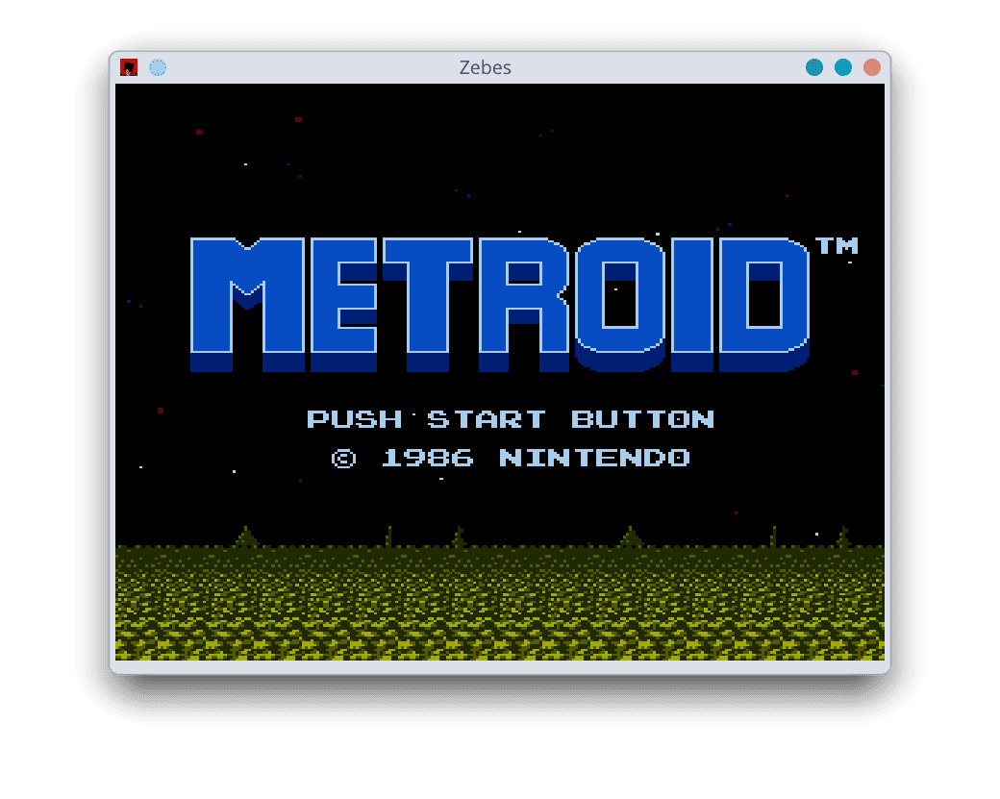

# Zebes (ゼーベス Zēbesu)



Zebes is a cross-platform NES emulator written from scratch in Rust for learning purposes and for fun.

## Features

- CPU (Ricoh 2A03/MOS 6502 core):
  - All [addressing modes](https://www.nesdev.org/wiki/CPU_addressing_modes).
  - All [official instructions](https://www.nesdev.org/wiki/Instruction_reference).
  - Cycle-accurate timing, including page-crossing, branch cycle penalties, etc.
  - NMI handling.
- PPU:
  - Background rendering with proper scrolling (loopy registers, fine + coarse scroll).
  - Sprite rendering with sprite zero hit, per-scanline sprite evaluation, and sprite overflow flag.
  - OAM DMA.
  - PPUDATA read buffering, include the palette RAM bypass.
  - All four nametable mirroring modes.
  - NTSC odd-frame cycle skip.
- Controller:
  - Very basic controller support with keyboard.
- Mappers:
  - [NROM](https://www.nesdev.org/wiki/NROM).
  - [MMC1](https://www.nesdev.org/wiki/MMC1).
  - [UxROM](https://www.nesdev.org/wiki/UxROM).
  - [CNROM](https://www.nesdev.org/wiki/CNROM).

> [!NOTE]
> There is no audio emulation yet (APU), and only the official 6502 instructions set is implemented at the moment. Also, more mappers like MMC3 and MMC5 are WIP.

## Build

Zebes is organized as a Cargo workspace with three main members:

- `zebes`: frontend built with [macroquad](https://macroquad.rs).
- `core`: emulator core used by both the frontend and the debugger.
- `debugger`: a terminal-based debugger built with [ratatui](https://ratatui.rs).

### Requirements

You will need to have Rust installed on your system as well as any dependencies `macroquad` may need.

### Building

Clone the repository:

```bash
git clone https://github.com/dnlzrgz/zebes.git
cd zebes
```

Build in `release` mode:

```bash
cargo build --release
```

### Install or run

You can run the frontend (default workspace member):

```bash
cargo run --release
```

Run the debugger:

```bash
cargo run --release -p zebes-debugger
```

Or install both:

```bash
cargo install --path zebes
cargo install --path zebes-debugger
```

> [!NOTE]
> `zebes` and `zebes-debugger` aren't published to crates.io yet, so `cargo install --path` (from a local clone) is currently the only way to install them. In the future I will also add a CI/CD pipeline to publish prebuilt binaries.

## Modules

### Core

### Debugger

### Frontend

#### Controls

## Motivation

I have always wanted to build an emulator. I don't know why, but it was one of those project ideas that's always somewhere in the back of your mind, and that you consider starting every once in a while. Eventually some circumstances aligned and gave me the excuse I needed to actually start, so here we are.

Being honest, I've never played a real NES in my life. My first console was a PlayStation 1, on which I burned through some games like "Spyro", "Crash Bandicoot 3", and "Digimon Rumble Arena". Later I was gifted a Game Boy SP, which I still treasure and which became one of the most important parts of my early adolescence. Still, I've always been curious about the NES.

This project is also a stepping stone. Once I reach a certain state of completion, I plan to move on to a GBA emulator, or maybe a PlayStation 1 one. There's still a long way to go before that, though.

Finally, this project doubled as an excuse to go much deeper into Rust, which I've decided will be my main language going forward.

## AI is just a chatbot

This probably isn't the right place for a deep dive into how I use AI to code, but I figured a small disclaimer is worth including anyway. I don't use any AI-driven coding tools, and I don't want this to become an AI-driven project. I use ChatGPT/Claude through their web pages (like a caveman) to ask questions, clarify terms, discuss implementation details, and generate some tests. I leaned on them a bit more for the PPU, which for some reason I kept misunderstanding and kept making wrong assumptions about. Everything else is just pure human-driven madness, lots of resources, and very bad coffee.

This is a personal learning project, and for now I don't plan on changing that, or how I use AI while working on it.

## Contributions

Right now I don't plan on accepting contributions. The project is still very green, and I still have to decide things like whether I'm aiming for "good enough" emulation or a "perfect" one. That said, if you have suggestions, ideas, or things you think I should improve, those are more than welcome.

This is far from the only NES emulator out there, so if you're looking for a project that's more open to contributions, there are others that might be a better fit.

## License

This project is licensed under the [MIT License](./LICENSE).

## References & Thanks

I have leaned quite heavily on the [Nesdev Wiki](https://www.nesdev.org/wiki/Nesdev_Wiki) and its many resources, guides, and explanations. I've also consulted the NES emulator series by [@javidx9](https://www.youtube.com/@javidx9) on YouTube more than once, along with the companion [source code](https://github.com/OneLoneCoder/olcNES), which is amazingly well documented.
