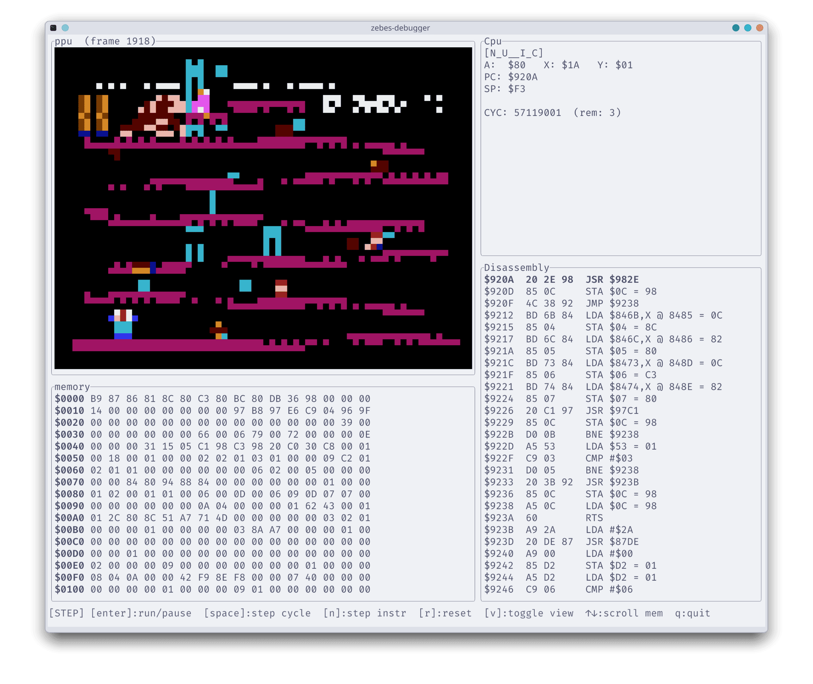

# Zebes - Debugger


A terminal-based debugger for [Zebes](../README.md) built with [ratatui](https://ratatui.rs).

## Features

- Live-rendered PPU framebuffer in the terminal itself.
- Step execution by individual CPU cycles or by full instruction.
- Free-run mode.
- Scrollable hex dump of the CPU address space.
- Live CPU register view.
- Live disassembly view.
- PPU register view.
- OAM (sprite memory) viewer.
- Switchable layouts.

## Usage

Right now this debugger is more of a companion tool for the development of Zebes than a full debugging suite. In the future I might add more useful functionality, but for the moment it's just a nice-to-have tool for me to observe the internals and make some checks.

```bash
cargo run --release -p zebes-debugger -- <rom.nes>
```

## Keybindings

| Key         | Action                           |
| ----------- | -------------------------------- |
| `Enter`     | Toggle run / pause               |
| `Space`     | Step one CPU cycle               |
| `n`         | Step one full instruction        |
| `r`         | Reset                            |
| `v`         | Toggle between CPU and PPU views |
| `↑` / `↓`   | Scroll the memory view           |
| `q` / `Esc` | Quit                             |

> [!note]
> Right now there is no support for controlling the game.

## Testing

The debugger's tracer has been validated against [nestest](https://www.nesdev.org/wiki/Emulator_tests#nestest).

```bash
cargo test
```

> [!NOTE]
> The test currently stops at the first unofficial (illegal) opcode in the golden log, since those aren't implemented yet.
